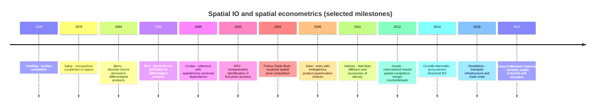

# Literature Review at the Intersection of Applied Industrial Organization and Spatial Econometrics

## Executive summary

Research at the applied industrial organization (IO)–spatial econometrics interface is unified by a common empirical problem: **economic interactions are shaped by geography or networks**, so outcomes in one “market” depend on distances, connectivity, and spillovers from nearby (or connected) locations. In applied IO, space enters **consumer demand** (travel costs, local tastes, and overlapping choice sets), **firm costs** (shipping and service radii), and **strategic interaction** (local price competition, entry deterrence, multi-market contact). In spatial econometrics, the same structure appears as **spatial dependence** in outcomes or errors, and as **spillovers** that require careful identification and interpretation. citeturn13search12turn1search3turn30search15

Because the specific “idea” is unspecified, the closest literatures are those that jointly address: **(i) endogenous market structure and competition with geographic differentiation**, **(ii) policy or shocks that change market access or bidding/entry incentives**, and **(iii) identification/inference under spatial dependence**. A representative instance of this combined structure—used here only as an illustration of the class of problems—appears in an uploaded project deck studying a **threshold-based procurement reform with local preferences**, emphasizing **spatial exclusion and cross-market capacity reallocation**. fileciteturn0file0

The key “closest” paper clusters are:

- **Spatial demand + local competition (structural IO)**: consumer choice with explicit geography and merger/policy counterfactuals (e.g., Davis on theaters; Houde on gasoline road networks; Ellickson–Grieco–Khvastunov on grocery retail competition without ex ante market boundaries). citeturn22view0turn22view1turn16view0  
- **Entry/location and dynamic spatial competition**: endogenous entry and store networks with spatial cannibalization and economies of density (e.g., Seim on video retail entry; Holmes on Wal‑Mart diffusion; Caoui–Hollenbeck–Osborne on dollar stores’ dynamic spatial entry and competitor relocation). citeturn25search7turn23view1turn31view3  
- **Procurement/auctions with participation, preferences, and capacity constraints**: bid preference programs and endogenous participation; threshold-based disclosure/publicity designs; dynamic procurement with backlog/capacity and subcontracting (e.g., Krasnokutskaya–Seim; Coviello–Mariniello; Jeziorski–Krasnokutskaya). citeturn27view0turn26view2turn36view3  
- **Market access, transport costs, and spatial price transmission**: causal and quantitative-trade approaches measuring trade costs from prices, networks, and natural experiments (e.g., Redding–Sturm; Faber; Donaldson; Allen–Arkolakis; Atkin–Donaldson; Engel–Rogers; Parsley–Wei). citeturn33view0turn33view1turn32view0turn32view1turn32view2turn7search12turn34view3  
- **Spatial econometrics foundations and cautions**: how to specify spatial dependence, interpret spillovers, and conduct valid inference (Anselin; LeSage; Conley; Kelejian–Prucha; plus the Gibbons–Overman critique emphasizing identification over mechanical spatial-lag modeling). citeturn1search0turn13search12turn30search0turn30search6turn35view2

Across these literatures, the main gaps that remain especially relevant to “IO + space” projects are: **(a) integrating structural strategic models with transparent causal identifying variation**, **(b) modeling cross-market linkages created by firms’ capacity constraints and multi-market participation**, and **(c) connecting “spillovers” in spatial econometrics to economically interpretable substitution/competition mechanisms** rather than reduced-form spatial autocorrelation. citeturn35view2turn36view3turn31view3

## How applied IO and spatial econometrics meet

Two abstractions unify both fields:

1. **Space as differentiation**: Consumers and firms are located; distance (or travel time) enters utility and/or costs. This is the core insight of Hotelling-style competition and its descendants. citeturn29view3turn0search1  
2. **Space as a dependence structure**: Outcomes (prices, entry, bids, productivity) can be correlated across nearby units because of common shocks, market access, strategic reactions, or genuine spillovers. Spatial econometrics formalizes this with spatial lag terms and/or structured covariance estimators. citeturn13search12turn30search0turn30search6

A generic “IO × space” research idea (standing in for an unspecified user idea) typically involves some combination of:

- **A market outcome**: price dispersion, markups, entry/exit, market power, allocation, or welfare.
- **A spatial mechanism**: travel cost, transport network connectivity, border frictions, agglomeration forces, or multi-market firm capacity constraints.
- **An identifying shock**: policy thresholds, boundary changes, transport infrastructure expansions, mergers, or contract changes that shift spatial competition. citeturn22view1turn33view1turn33view0turn27view1

The uploaded deck illustrates one such template: a **threshold-based procurement rule change** that plausibly shifts *who can compete where*, and may generate *spatial spillovers* through firms reallocating capacity across markets. This is a canonical setting where applied IO tools (entry and bidding models; participation responses) and spatial methods (spillover-aware inference; geography-based exposure) can be complementary. fileciteturn0file0

Conceptually, most projects in this space can be organized as follows. (The diagram is generic; it is not tied to any single application.) citeturn13search12turn22view1turn35view2

```mermaid
flowchart TD
  A[Geography / network W\n(distance, travel time, adjacency)] --> B[Demand system\n(location enters utility)]
  A --> C[Cost / feasibility\n(shipping, capacity, service radius)]
  B --> D[Strategic interaction\n(pricing, entry/exit, bidding)]
  C --> D
  D --> E[Observed outcomes\n(prices, bids, winners, entry, output)]
  A --> F[Spatial dependence\n(correlated shocks, spillovers)]
  F --> E
  G[Policy / shock\n(thresholds, infrastructure, mergers)] --> B
  G --> C
  G --> D
  E --> H[Counterfactuals\n(welfare, competition, spillovers)]
```

## Core methodological foundations

### Core spatial competition building blocks

- **Hotelling (1929)** introduced the canonical logic of **location as product differentiation** and “local” competitive interactions. citeturn29view3  
- **Salop (1979)** provides a tractable framework for spatial (or “variety-space”) competition with differentiated products, widely used as a workhorse in applied IO. citeturn0search1  

These papers matter for applied work because spatial differentiation implies that **(i) substitutability is distance-dependent**, **(ii) competitive effects are localized**, and **(iii) policy or entry shocks can have gradients and spillovers rather than uniform effects.** citeturn29view3turn0search1turn21search4

### Structural IO toolkits most used in spatial applications

- **Differentiated products demand + supply**: Berry (1994) and Berry–Levinsohn–Pakes (1995) (BLP) establish the modern empirical framework for estimating demand and marginal costs under imperfect competition, forming the backbone for most structural spatial demand and merger analyses. citeturn14search2turn29view0  
- **Entry and market structure**: Bresnahan–Reiss (1991) provide an empirical framework relating market size to the number of firms, often adapted to geographically delineated or isolated markets. citeturn23view2  
- **Auctions/procurement identification**: Guerre–Perrigne–Vuong (2000) show nonparametric identification and estimation of first-price auctions (a common building block for procurement studies), while Athey–Levin–Seira (2011) show how auction format affects entry and outcomes, combining reduced-form evidence with a structural model of participation and bidding. citeturn29view2turn17search4turn24view3  

### Spatial econometrics: specification, interpretation, and inference

A key practical distinction is between:

- **“Spatial dependence as structure”** (e.g., spatial lag models where neighbors’ outcomes directly affect one’s own), versus  
- **“Spatial dependence as nuisance”** (e.g., correlated errors or common shocks that require robust inference). citeturn13search12turn30search0

Classic and widely used references include:

- **Anselin (1988)** for foundational spatial econometric models and diagnostics. citeturn1search0turn15search2  
- **LeSage (2008)** and the broader LeSage–Pace tradition for spatial regression specifications and the interpretation of direct/indirect effects (especially the logic behind “spillover” decomposition). citeturn13search12  
- **Conley (1999)** for GMM and inference under **cross-sectional/spatial dependence** (spatial HAC style ideas). citeturn30search0  
- **Kelejian–Prucha (1998)** for feasible estimation of spatial autoregressive structures, and **Kelejian–Prucha (2007)** for spatial HAC covariance estimation. citeturn13search4turn8search11turn30search6  
- **Gibbons–Overman (2012)** (and related versions) for a prominent critique: without credible identification, many spatial-lag regressions provide weak causal content; quasi-experimental designs and economic structure should lead model choice. citeturn35view2turn30search11  

The timeline below highlights how “space” migrated from theory, to IO empirics, to modern data-rich structural and causal work. citeturn29view3turn29view0turn22view1turn31view3turn35view2



### Comparison table of methodological “building block” references

| Reference | Primary object | Core model | What it enables in IO×space applications |
|---|---|---|---|
| Hotelling (1929) citeturn29view3 | Spatial competition | Location-based differentiation | Distance-dependent substitution and local competition logic |
| Salop (1979) citeturn0search1 | Spatial/variety competition | Circular-city monopolistic competition | Tractable spatial competition; mapping variety-space to geography |
| Berry (1994); BLP (1995) citeturn14search2turn29view0 | Demand & markups | Discrete choice + oligopoly equilibrium | Counterfactuals: mergers, entry, policy; flexible substitution |
| Conley (1999) citeturn30search0 | Inference | Cross-sectional dependence robust variance | Valid standard errors with spatial correlation |
| Kelejian–Prucha (1998, 2007) citeturn13search4turn30search6 | Estimation & inference | SAR estimation; spatial HAC | Practical estimation/inference in spatial regression settings |
| LeSage (2008) citeturn13search12 | Interpretation | Spatial Durbin-type models; direct/indirect effects | Interpretable spillover decomposition when model is credible |
| Gibbons–Overman (2012) citeturn35view2turn30search11 | Identification critique | “Mostly pointless” warning | Forces focus on quasi-experimental designs and economic structure |

## Closest papers to typical IO×space ideas

This section provides “paper briefs” for influential and closely related work. Each brief includes: research question, model, data, identification, findings, strengths/limitations, and how it can be relevant to an unspecified idea combining spatial competition and econometric spillovers.

### Spatial demand estimation and localized competition

**Davis (2006), “Spatial Competition in Retail Markets: Movie Theaters.”** citeturn22view0  
Davis estimates a retail demand model that explicitly uses **the locations of theaters and the geographic distribution of consumers** to explain market shares and competition between theaters. The modeling choice is to build demand from consumer choice over spatially located alternatives, rather than pre-defined markets. citeturn22view0  
Main findings are that explicitly modeling geography changes measured substitution patterns and competitive effects; the paper’s core contribution is methodological: demand estimation that respects overlapping catchment areas and spatially varying choice sets. citeturn22view0  
Strengths include transparent incorporation of consumer geography and a clear link between data on locations and competitive interactions. A limitation for many modern applications is that richer microdata on individual trips or multi-purpose shopping is not modeled (a common tradeoff in tractability). Relevance: any idea about **spatial differentiation, demand estimation, or policy/entry shocks affecting local competition** can use Davis as a template for how to build spatial choice sets and map geography into substitution. citeturn22view0

**Houde (2012), “Spatial Differentiation and Vertical Mergers in Retail Markets for Gasoline.”** citeturn22view1turn7search7  
Houde develops an empirical model of spatial competition in gasoline markets in which **commuting paths along a road network** act as the relevant “locations” of consumers, rather than Euclidean distance. The paper estimates the model using panel data from the Quebec City gasoline market and evaluates a vertical merger. citeturn7search7turn22view1  
A central contribution is that **road-network structure and traffic flows** determine competitive proximity, which can produce localized merger effects even when overall market structure changes little. The paper also illustrates how reduced-form difference-in-differences comparisons can be sensitive to confounding events (discussed as a caution). citeturn22view1  
Strengths: economic realism (network-based travel), direct policy relevance (merger simulation), and clear mapping from transport networks to competition. Limitations: requires detailed network and commuting/OD data; results can depend on assumptions about route choice and demand structure. Relevance: ideal for ideas where **connectivity, travel time, and spatial exposure** matter (e.g., transport shocks, zoning, procurement delivery radii, or local preference rules that effectively alter “reach” across space). citeturn22view1turn7search7

**Pinkse–Slade–Brett (2002), “Spatial Price Competition: A Semiparametric Approach.”** citeturn21search4turn21search2  
This paper studies whether price competition is “global” or “local” by estimating cross-price responses in a semiparametric way and applying the approach to U.S. wholesale gasoline markets; the main empirical conclusion is that competition is highly localized. citeturn21search4turn21search2  
Strengths include an explicit attempt to let data discriminate between localized vs global competitive interactions and weaker functional-form restrictions than fully parametric alternatives. Limitations: semiparametric IV identification can be demanding and sensitive to instrument strength and measurement—issues later work highlights as central in spatial competition settings. Relevance: closest when an idea requires **testing or estimating the radius of competitive interaction** (e.g., how far a firm’s pricing or bidding response “travels”). citeturn21search4turn21search12

**Ellickson–Grieco–Khvastunov (2019), “Measuring Competition in Spatial Retail.”** citeturn16view0  
They propose a spatially aggregated discrete choice model that **avoids defining markets ex ante**, using store locations and consumer residential geography to estimate substitution patterns and evaluate mergers in grocery retail. The approach leverages chain-level regularities (e.g., relative uniformity of pricing/assortment decisions) to reduce data requirements. citeturn16view0  
They find substantial cross-format competition (e.g., between supercenters, club stores, and traditional grocers) and show how the model can inform antitrust screening by identifying where competitive pressure is most affected. citeturn16view0  
Strengths: directly targets a common spatial IO pain point—market definition—while providing a tractable framework for substitution patterns. Limitations: abstracts from explicit price variation in their application (by design), which can limit welfare measurement in some applications; identification relies heavily on covariation between locations and demographics. Relevance: strong match for ideas about **market power measurement, merger screening, or policy effects** in settings with overlapping catchment areas and limited price microdata. citeturn16view0

**Hastings (2004), “Vertical Relationships and Competition in Retail Gasoline Markets: Evidence from Contract Changes in Southern California.”** citeturn27view1turn37search3  
Hastings studies how discrete changes in vertical contracts/ownership in gasoline retail affect local prices, exploiting contract changes that differentially affect stations and nearby competitors. citeturn27view1turn37search3  
Strengths: sharp event-like variation and a clear local-competition mechanism; it is a canonical illustration of how spatial competition makes treatment effects highly local. A limitation for generalization is that institutional details of gasoline contracting and branding matter, and replication debates in later commentary underscore sensitivity to data and specification choices in spatial settings. citeturn27view1turn37search14  
Relevance: any idea using **contract changes, mergers, or regulation** to identify localized competitive effects can treat Hastings as a blueprint for “event + geography” identification. citeturn27view1turn37search3

#### Comparison table: spatial demand/price competition papers

| Paper | Setting | Model | Data | Identification / variation | Empirical takeaway most relevant to “IO×space” |
|---|---|---|---|---|---|
| Davis (2006) citeturn22view0 | Movie theaters | Spatial demand with explicit consumer geography | Theater locations + consumer distribution | Cross-sectional spatial variation in alternatives’ proximity | Choice sets overlap; space materially changes substitution |
| Houde (2012) citeturn22view1turn7search7 | Gasoline retail | Hotelling-style competition on road network + merger simulation | Panel prices + road network + OD commuting | Network-based competitive proximity; merger counterfactual | Merger effects local and road-network dependent |
| Pinkse–Slade–Brett (2002) citeturn21search4 | Wholesale gasoline | Semiparametric cross-price response estimation | Gasoline market data | IV series estimator for cross-price effects | Competition is localized; “radius” is empirically testable |
| Ellickson–Grieco–Khvastunov (2019) citeturn16view0 | Grocery retail | Spatially aggregated discrete choice, no ex ante market definition | Store locations + revenues + demographics | Location–demographic covariation; format nesting | Cross-format competition can be substantial; market definition is endogenous |
| Hastings (2004) citeturn27view1turn37search3 | Gasoline retail | Reduced-form/local competition around contract changes | Station-level data | Contract/ownership change + local exposure | Spatial “treatment intensity” matters; local competitors respond |

### Entry, exit, and spatial market structure

**Bresnahan–Reiss (1991), “Entry and Competition in Concentrated Markets.”** citeturn23view2  
They propose an empirical framework for measuring how the number of producers varies with market demand and competition, using geographically isolated markets to infer competitive conduct from entry thresholds. citeturn23view2  
Strengths: a parsimonious mapping from market size to implied competition; widely applicable where markets can be approximated as isolated. Limitation: geographic isolation is an assumption and can be violated when consumers/firms multi-home across nearby markets—precisely the problem many modern “continuous space” models aim to avoid. Relevance: baseline for ideas where a policy or shock changes market size/access and thus entry outcomes, especially when markets are discretized (municipalities, commuting zones, procurement jurisdictions). citeturn23view2turn16view0

**Seim (2006), “An Empirical Model of Firm Entry with Endogenous Product-Type Choices.”** citeturn25search7turn25search0  
Seim models firms’ joint entry and differentiated product-type choices in a setting where **location is a form of differentiation** (video retail). The approach formalizes these choices as a game and estimates the model to quantify returns to differentiation. citeturn25search7turn25search0  
Strengths: makes product-type/location choice endogenous, allowing asymmetric competition across types; offers a structural entry framework tailored to geographic differentiation. Limitations: computational burden and equilibrium selection/solution issues are inherent; external validity depends on how well location choice proxies product differentiation in the target setting. Relevance: very close to any idea about **entry deterrence, spatial differentiation, and policy changes that shift who enters where** (including procurement participation if “entering” is bidding/participation). citeturn25search7turn31view3

**Holmes (2011), “The Diffusion of Wal‑Mart and Economies of Density.”** citeturn23view1  
Holmes studies why Wal‑Mart expanded in a spatially contiguous way, maintaining high density. The key idea is to infer the value of density economies from Wal‑Mart’s willingness to tolerate sales cannibalization, using a dynamic model with detailed geography on stores and distribution centers and a revealed-preference/moment-inequality approach. citeturn23view1  
Strengths: explicitly links store network geography to distribution costs and dynamic expansion; demonstrates how to do credible inference when full dynamic solution is infeasible. Limitations: highly tailored to a large chain’s expansion problem; extensive data needs. Relevance: close to ideas with **multi-market firms, capacity/logistics constraints, and spatial spillovers** (e.g., effects of local preference policies that reallocate firm capacity across jurisdictions). citeturn23view1turn36view3

**Jia (2008), “What Happens When Wal‑Mart Comes to Town: An Empirical Model of Discount Retailing.”** citeturn2search3turn22view3  
Jia estimates a structural model of competition among discount retailers and small firms (Wal‑Mart, Kmart, and entrants), using data over time to study how big-box expansion affects local market structure, including small-store exit. citeturn2search3turn22view3  
Strengths: directly addresses how a large entrant changes local structure and how equilibrium entry responses matter. Limitations: requires assumptions about profit functions and the relevant geographic market; chain-level strategies and logistics can be hard to summarize. Relevance: close to ideas about **how entry shocks propagate through local exit and competitive responses**, a pattern also plausible in procurement when a rule change makes some bidders effectively more/less competitive across space. citeturn2search3turn23view1

**Caoui–Hollenbeck–Osborne (2024), “Dynamic Entry & Spatial Competition.”** citeturn31view3  
They build a dynamic structural model of entry/exit in spatially differentiated retail locations, emphasizing that dollar store expansion affects not only treated locations but also induces **spatial relocation of rivals**, so net effects require modeling the long-run spatial distribution of stores. citeturn31view3  
They report sizable reductions in grocery and convenience stores associated with dollar store expansion in counterfactuals and emphasize non-stationary dynamics due to the growth of distribution centers that reduce operating costs over time. citeturn31view3  
Strengths: modern dynamic spatial IO with explicit competitor relocation and non-stationary cost shifters; directly addresses an IO×space gap: equilibrium spatial reallocation. Limitations: demanding estimation and equilibrium assumptions; results depend on state-space specification and data on the location-time evolution of stores and costs. Relevance: exceptionally close to ideas involving **capacity constraints, cross-market linkages, and spillovers**—including procurement settings where winning one contract affects the ability to bid elsewhere (a theme also central in dynamic procurement modeling). citeturn31view3turn36view3

**Aguirregabiria–Suzuki (2015), “Empirical Games of Market Entry and Spatial Competition” (survey, CEPR).** citeturn12search7  
This survey is useful as a map of the empirical IO literature on structural entry games and spatial competition, including common modeling choices and empirical challenges. citeturn12search7  
Relevance: if the unspecified idea is still at the modeling stage, this survey is a high-leverage starting point for choosing between static vs dynamic entry, discretized vs continuous space, and how to treat multi-store firms. citeturn12search7

#### Comparison table: entry/dynamics papers

| Paper | Core decision | Spatial mechanism | Data | Identification / key variation | Main finding relevant to “spatial market structure” |
|---|---|---|---|---|---|
| Bresnahan–Reiss (1991) citeturn23view2 | Entry counts | Geographically isolated markets | Cross-market industry counts | Market size variation | Entry thresholds reveal intensity of competition |
| Seim (2006) citeturn25search7 | Entry + product type | Location as differentiation | Retail market data | Structural estimation of entry game | Differentiation yields significant profit effects |
| Holmes (2011) citeturn23view1 | Store rollout path | Density economies + cannibalization | Store locations + sales + distribution centers | Revealed preference / moment inequalities | Dense contiguous networks can be optimal; density value is sizable |
| Jia (2008) citeturn2search3 | Chain entry and local structure | Big-box competitive pressure | Retail market data | Structural counterfactuals over time | Large entrants induce exit/structure change; equilibrium responses matter |
| Caoui–Hollenbeck–Osborne (2024) citeturn31view3 | Dynamic entry/exit | Rival relocation; nonstationary costs | Store panel + distribution center evolution | Dynamic structural estimation with terminal actions | Ignoring spatial reallocation biases net effects of entry shocks |

### Procurement, auctions, and policies that reshape spatial competition

Procurement is often a natural bridge between IO and spatial methods because bidders face: (i) **participation/entry costs**, (ii) **capacity constraints/backlogs**, and (iii) **geographic frictions** (service radii, local advantages, delivery costs). citeturn36view3turn24view3turn27view0

**Krasnokutskaya–Seim (2011), “Bid Preference Programs and Participation in Highway Procurement Auctions.”** citeturn27view0  
They use data from California highway procurement auctions subject to a small business preference program and estimate a model of firms’ bidding and participation to evaluate the effects of current and alternative policy designs, emphasizing that participation responses change assessments of preferential treatment. citeturn27view0  
Strengths: explicitly incorporates endogenous participation as the channel through which preferences matter; directly policy-relevant counterfactual designs. Limitations: full-text access restrictions can make replication harder without institutional access; inference depends on model assumptions about costs and entry. Relevance: extremely close to any idea about **local preference thresholds, set-asides, or eligibility rules** that change effective competition by changing who participates. citeturn27view0turn10search1

**Marion (2007), “Are Bid Preferences Benign? The Effect of Small Business Subsidies in Highway Procurement Auctions.”** citeturn10search0turn37search11  
Marion studies the cost and entry effects of bid preferences in highway procurement using California data, contributing early empirical evidence on how preferences affect procurement costs and bidding/entry decisions. citeturn10search0  
Strengths: policy relevance and focus on asymmetric treatment. Limitations: the exact design details and general equilibrium effects may be setting-specific; effects can differ depending on how preferences alter entry incentives versus ex post allocation. Relevance: provides a reduced-form benchmark against which richer structural or spatial-spillover models can be compared—especially if the unspecified idea concerns **whether preferences reduce competition or reallocate it across space**. citeturn10search0turn36view3

**Coviello–Mariniello (2014), “Publicity Requirements in Public Procurement: Evidence from a Regression Discontinuity Design.”** citeturn10search2turn26view2  
They document the effect of increasing procurement publicity above a reserve/threshold using an RD design: auctions above the threshold must be publicized more widely, and the paper finds increased entry and more aggressive bidding (higher rebates), with evidence that the number of bidders is an important channel. citeturn26view2  
Strengths: transparent identification via a legal threshold and strong internal validity around the cutoff. Limitations: the RD estimates are local and may not generalize far from the threshold; institutional details (auction format, information intermediaries) matter. Relevance: directly applicable to any **threshold-based rule change** (including eligibility thresholds, local preference cutoffs, or disclosure requirements) and to ideas where the main mechanism is changing who learns about or can profitably enter an auction. citeturn26view2

**Decarolis (2014), “Awarding Price, Contract Performance, and Bids Screening.”** citeturn10search3  
Decarolis provides evidence on a tradeoff in first-price procurement when winning bids are not fully binding commitments and ex post renegotiation can erode apparent savings, exploiting variation in the timing of auction format introduction in Italy. citeturn10search3  
Strengths: connects auction design to ex post performance, an outcome often ignored in bid-only analyses. Limitation: institutional reliance on renegotiation rules; mapping to other procurement environments requires care. Relevance: important if the unspecified idea is about **policy changes affecting not only prices/bids but completion, quality, or renegotiation**, and how those effects may vary spatially with contractor availability. citeturn10search3

**Jeziorski–Krasnokutskaya (2016), “Dynamic Auction Environment with Subcontracting.”** citeturn36view3  
They model and quantify the role of subcontracting in a procurement environment with **private cost variability and capacity constraints/backlog accumulation**, using calibrated parameters to match California procurement data. They report that restricting subcontracting raises procurement costs and reduces completed projects, emphasizing dynamic and capacity mechanisms. citeturn36view3  
Strengths: directly addresses one of the hardest practical issues in spatial procurement contexts—capacity constraints that link auctions over time and potentially across space. Limitations: calibration/model structure is demanding; requires data and assumptions about backlog dynamics and subcontracting. Relevance: a cornerstone for any idea where **winning today affects capacity to bid tomorrow**, which naturally generates spatial and cross-market spillovers as firms reallocate attention across regions/jurisdictions. citeturn36view3turn31view3

**Kang–Miller (2022), “Winning by Default: Why Is There So Little Competition in Government Procurement?”** citeturn11search1turn11search16  
They develop and estimate a principal-agent procurement model motivated by U.S. federal procurement where agencies seek sellers at a cost and negotiate terms; the model is identified and estimated with IT/telecom contract data to explain low-bid competition (often one bid). citeturn11search1turn11search16  
Strengths: shifts focus from bidding alone to the upstream process of buyer search and seller recruitment. Limitations: less explicitly spatial in baseline form; spatial extensions would require modeling how search costs and seller availability vary geographically. Relevance: useful if the unspecified idea involves **participation frictions** that vary across space (e.g., remote areas, local informational networks, or procurement platforms that change who gets solicited). citeturn11search1

**Hanspach (2023), “The Home Bias in Procurement: Cross-Border Procurement of Medical Supplies during the Covid-19 Pandemic.”** citeturn19search0turn19search4  
This paper constructs procurement award data for medical supplies in Europe and studies home bias/cross-border procurement patterns during Covid, documenting large changes in cross-border procurement associated with local conditions and rule regimes. citeturn19search0turn19search4  
Strengths: directly ties procurement outcomes to geography and cross-border frictions; uses a salient external shock. Limitations: crisis context may not generalize; procurement rules and emergency policies complicate interpretation. Relevance: closest if the unspecified idea involves **border frictions, local sourcing policies, or spatial disruptions** (transport, emergency procurement, trade restrictions) that affect the geography of awards. citeturn19search0

**Bombardini–Gonzalez‑Lira–Li–Motta (2024), “The Increasing Cost of Buying American.”** citeturn36view1turn36view2  
They evaluate Buy American procurement restrictions using procurement microdata and a quantitative trade model incorporating government-sector demand, barriers in final and intermediate goods, labor force participation, and external economies of scale, producing job-creation and cost-per-job implications. citeturn36view1turn36view2  
Strengths: rigorous link from procurement rules to trade/production equilibrium and welfare/cost metrics. Limitations: macro/quantitative-trade abstraction may not capture fine spatial competition mechanisms unless explicitly layered in (e.g., within-country location and firm capacity). Relevance: closest to ideas where procurement preferences function as **trade barriers** and where the goal is to quantify general equilibrium incidence, potentially with spatial heterogeneity in exposure. citeturn36view1turn32view1

**Athey–Levin–Seira (2011), “Comparing Open and Sealed Bid Auctions: Evidence from Timber Auctions.”** citeturn17search4turn24view3  
They study entry and bidding patterns across auction formats in U.S. Forest Service timber auctions; sealed bid auctions attract more small bidders and can generate higher revenue, and the authors estimate a private-value model with endogenous participation to rationalize the patterns. citeturn24view3turn17search4  
Strengths: canonical combination of clean institutional variation (including format variation) with structural modeling of participation. Limitations: not inherently spatial, but readily extended when bidder costs depend on distance to tracts/projects. Relevance: very close if the idea involves **policy design in auctions** and anticipates participation responses, which can be geographically heterogeneous. citeturn24view3turn36view3

#### Comparison table: procurement and preference-policy papers

| Paper | Policy lever | Model | Data | Identification | Findings most transferable to spatial policy ideas |
|---|---|---|---|---|---|
| Marion (2007) citeturn10search0 | Bid preference | Empirical evaluation of preferences | CA highway auctions | Variation in preference application | Preferences affect entry/bids; benchmark for later structural work |
| Krasnokutskaya–Seim (2011) citeturn27view0 | Bid preference | Structural bidding + participation | CA highway procurement | Model-based counterfactual policy designs | Participation response is central to welfare/cost assessment |
| Coviello–Mariniello (2014) citeturn26view2 | Publicity threshold | RD around reserve-price cutoff | Italian procurement | RD at legal threshold | Publicity increases entry and aggressiveness; threshold designs are powerful |
| Decarolis (2014) citeturn10search3 | Auction format change | Procurement + ex post performance | Italian public works | Timing of format introduction | Award-stage savings can be offset by renegotiation |
| Jeziorski–Krasnokutskaya (2016) citeturn36view3 | Subcontracting availability | Dynamic procurement with backlog/capacity | CA procurement market | Structural calibration to match data | Capacity constraints link auctions; policies affect completion and costs |
| Hanspach (2023) citeturn19search0 | Cross-border frictions | Empirical home-bias analysis | EU medical procurement | Pandemic shock + rule environment | Geography strongly shifts award patterns |
| Bombardini et al. (2024) citeturn36view1 | Buy American restrictions | Quantitative trade model + micro procurement | US procurement microdata | Model-based quantitative evaluation | Procurement rules act like trade barriers; heterogeneous incidence |
| Kang–Miller (2022) citeturn11search1 | Buyer search frictions | Principal-agent/search model | US federal procurement | Structural identification with contract data | Low competition can reflect costly seller search, not only bidder behavior |

### Agglomeration, market access, transport costs, and spatial price transmission

These papers are closest when the unspecified idea involves **transport networks, trade costs, or the spatial incidence of policy**, including spillovers across connected locations.

**Redding–Sturm (2008), “The Costs of Remoteness: Evidence from German Division and Reunification.”** citeturn33view0  
They exploit German division and reunification as a natural experiment to test the importance of market access in a new economic geography model, finding relative declines in population growth for West German cities near the former border after division. citeturn33view0  
Strengths: compelling historical shock and clear market-access mechanism; strong template for border-based identification. Limitations: macro/urban scale rather than firm-level IO; translating to micro competition requires additional structure. Relevance: any idea involving **boundary shocks, market access, and spatially varying exposure** can use this design logic. citeturn33view0

**Faber (2014), “Trade Integration, Market Size, and Industrialization: Evidence from China’s National Trunk Highway System.”** citeturn33view1  
Faber uses China’s highway expansion as a large-scale natural experiment and proposes an IV strategy based on least-cost path spanning networks to address endogenous route placement, finding that peripheral counties connected to large agglomerations can experience reduced GDP growth and industrial output growth, consistent with trade-based reallocation toward cores. citeturn33view1  
Strengths: strong instrument logic for networks; directly studies asymmetric market sizes and spatial distributional effects. Limitations: macro outcomes; mechanisms can be multi-channel. Relevance: closest when policy changes **connect markets** (or change effective competition radius), creating winners/losers across space and requiring careful network exposure measures. citeturn33view1turn22view1

**Donaldson (2018), “Railroads of the Raj: Estimating the Impact of Transportation Infrastructure.”** citeturn32view0turn6search4  
Donaldson estimates how railroads reduced trade costs and price gaps and increased trade, using detailed historical data and a model-based sufficient-statistic approach linking trade costs, trade flows, and welfare (real income). citeturn32view0turn6search4  
Strengths: high-quality data construction and disciplined welfare analysis; a leading example of combining reduced-form and structural steps. Limitations: historical setting; micro IO extensions require additional firm/consumer structure. Relevance: foundational for ideas about **transport costs, spatial price dispersion, market integration, and welfare incidence**. citeturn32view0turn32view2

**Allen–Arkolakis (2014), “Trade and the Topography of the Spatial Economy.”** citeturn32view1turn6search10  
They develop a general equilibrium framework for the spatial distribution of economic activity on arbitrary geography, estimate the topography of trade costs/productivity/amenities in the U.S., and quantify welfare impacts of infrastructure (e.g., the interstate highway system). citeturn32view1turn6search10  
Strengths: flexible spatial GE with continuous geography; explicit trade-cost “topography.” Limitations: aggregation; micro competition mechanisms appear via reduced-form or parameterized spillovers rather than explicit firm strategic interaction. Relevance: closest for ideas that need **general equilibrium accounting of spatial spillovers** from infrastructure or policy. citeturn32view1

**Atkin–Donaldson (2015), “Who’s Getting Globalized? The Size and Implications of Intra-national Trade Costs.”** citeturn32view2turn6search7  
They develop a methodology to estimate intranational trade costs from spatial price gaps, applying it to CPI microdata in Ethiopia and Nigeria (and the U.S.) and addressing key challenges in inferring trade costs from prices. citeturn32view2turn6search7  
Strengths: directly addresses spatial price dispersion as a measurement tool for trade costs; relevant for within-country incidence. Limitations: requires tight mapping between observed price gaps and costs/markups; identification depends on assumptions about markups and measurement. Relevance: strong match for ideas involving **spatial price transmission and market access**, including procurement input costs or delivery costs that vary across geography. citeturn32view2

**Duranton–Overman (2005), “Testing for Localization Using Micro-Geographic Data.”** citeturn33view3  
They develop distance-based tests of localization that treat space as continuous and provide statistical significance, using exhaustive U.K. micro-geographic establishment data; they find localization is common and largely at small scales (<50 km). citeturn33view3  
Strengths: avoids arbitrary spatial units; provides tools to measure clustering robustly. Limitations: descriptive clustering is not causal; mapping to welfare or competition needs additional structure. Relevance: useful when an idea needs to measure **agglomeration or clustering** of firms and relate it to competition or policy exposures. citeturn33view3turn35view2

**Ellison–Glaeser (1997), “Geographic Concentration in U.S. Manufacturing Industries: A Dartboard Approach.”** citeturn35view0  
They develop an index and methodology to measure localization beyond what random plant placement would imply, accounting for plant size distributions and overall manufacturing concentration, and document widespread localization. citeturn35view0  
Strengths: foundational measurement framework for industrial concentration across space; widely cited. Limitation: not itself an identification design; causal mechanisms require follow-on work. Relevance: important baseline if an idea needs to quantify whether observed spatial patterns reflect more than compositional randomness. citeturn35view0

**Engel–Rogers (1996), “How Wide Is the Border?”** citeturn7search12turn7search20  
They use CPI data for U.S. and Canadian cities to study deviations from the law of one price and show that distance explains variation, but border effects amplify price volatility beyond distance alone. citeturn7search12turn7search20  
Relevance: directly informs ideas about **border frictions** and spatial price dispersion, including how policy boundaries (jurisdictional, regulatory) can generate “extra distance.” citeturn7search12

**Parsley–Wei (1996), “Convergence to the Law of One Price Without Trade Barriers or Currency Fluctuations.”** citeturn34view3  
Using a panel of prices across U.S. cities, they estimate the speed of convergence to PPP and show distance slows convergence but cannot fully explain border-slow convergence, providing a benchmark for spatial price transmission within a highly integrated market. citeturn34view3  
Relevance: provides a template for estimating how quickly spatial price gaps close and how distance/taxes matter, which can be repurposed for **input price transmission** or procurement cost pass-through across regions. citeturn34view3

#### Comparison table: market access, agglomeration, and spatial price transmission

| Paper | Shock / variation | Data scale | Identification strategy | Key spatial mechanism | Why it is “closest” to many IO×space ideas |
|---|---|---|---|---|---|
| Redding–Sturm (2008) citeturn33view0 | Border division/reunification | City-level | Natural experiment | Market access discontinuity | Clean exposure gradient; boundary logic |
| Faber (2014) citeturn33view1 | Highway network expansion | County-level | IV via least-cost paths | Core–periphery integration | Network exposure; distributional effects |
| Donaldson (2018) citeturn32view0 | Railroad rollout | District × time | Empirical steps + sufficient statistics | Trade costs from price gaps | Links networks → trade costs → welfare |
| Allen–Arkolakis (2014) citeturn32view1 | Infrastructure counterfactual | Continuous space | Quantitative spatial equilibrium | Trade-cost topography | GE incidence; spatial spillovers |
| Atkin–Donaldson (2015) citeturn32view2 | Spatial price gaps | Market-level | New methodology to infer τ(X) | Intranational trade costs | Direct bridge to spatial price transmission |
| Duranton–Overman (2005) citeturn33view3 | N/A (measurement) | Establishment microdata | Distance-based localization tests | Continuous space clustering | Tools to characterize spatial structure prior to causal modeling |
| Ellison–Glaeser (1997) citeturn35view0 | N/A (measurement) | Industry × region | Dartboard index | Localization beyond randomness | Baseline for “is clustering real?” questions |
| Engel–Rogers (1996) citeturn7search12 | Border vs within-country | City price indices | Cross-sectional price gap decomposition | Border adds “extra distance” | Boundary frictions and law-of-one-price failures |
| Parsley–Wei (1996) citeturn34view3 | Distance/taxes within US | City-level prices | Panel convergence estimation | Spatial convergence rates | Benchmark transmission speed within integrated market |

### Spatial spillovers and network effects as “generalized space”

Many contemporary “spatial” questions are better represented as **networks** (supply chains, information networks, adjacency matrices), where spatial econometrics and network econometrics overlap.

**Bramoullé–Djebbari–Fortin (2009), “Identification of Peer Effects through Social Networks.”** citeturn8search14turn8search2  
They provide identification conditions for peer effects when interactions are structured through a network, helping clarify when spillovers are separately identifiable from correlated effects. citeturn8search14  
Relevance: if the unspecified idea uses spatial adjacency (neighbors, commuting flows, supplier networks) as the interaction matrix, this paper provides a conceptual benchmark for what is and is not identifiable when outcomes depend on neighbors. citeturn8search14turn35view2

**Rysman (2004), “A Study of the Market for Yellow Pages.”** citeturn37search10turn8search4  
Rysman estimates network effects in a two-sided setting via simultaneous equations for consumer usage, advertiser demand, and publisher behavior, finding economically meaningful network effects and surplus implications. citeturn37search10  
Relevance: useful when an idea includes **platform/network externalities** that may vary geographically (e.g., local density of adopters) or interact with spatial reach. citeturn37search10turn8search9

**Farrell–Klemperer (2007), “Coordination and Lock-In: Competition with Switching Costs and Network Effects.”** citeturn8search9turn8search1  
A standard reference clarifying mechanisms (switching costs vs network effects) and their implications for market power and policy. citeturn8search9  
Relevance: if an idea mixes **spatial frictions** with **network effects** (e.g., adoption externalities localized in space), this survey provides the conceptual language for modeling and welfare. citeturn8search9

## Gaps, concrete research directions, and datasets

### Key gaps at the IO–space intersection

A set of recurring gaps emerges across the closest literatures:

- **From “spatial dependence” to “economic spillovers.”** Spatial econometric models can estimate indirect effects, but without credible identification they risk capturing nuisance correlation rather than interpretable competitive or demand spillovers. The Gibbons–Overman critique is especially relevant: prioritize identification and economic structure, then use spatial tools for inference and interpretation. citeturn35view2turn30search0turn13search12  
- **Capacity constraints as the microfoundation for spatial spillovers.** In procurement and multi-market retail, capacity/backlog means a firm’s action in one location affects outcomes elsewhere. This is explicit in dynamic procurement with subcontracting and in modern dynamic spatial entry models; it remains under-used in many reduced-form spatial policy evaluations. citeturn36view3turn31view3  
- **Market definition vs continuous space.** Many applications still require discretizing markets (counties, municipalities). Methods that avoid ex ante market boundaries (Davis; Ellickson–Grieco–Khvastunov) or use road networks (Houde) show practical alternatives. citeturn22view0turn22view1turn16view0  
- **Policy thresholds with spillovers.** Threshold RD designs are clean for local effects (Coviello–Mariniello), but less often extended to quantify cross-market spillovers induced by responses (entry shifting, capacity reallocations). That extension is a natural “next paper” for many settings. citeturn26view2turn31view3turn36view3  
- **Integrating micro competition with macro market access.** Transport/market access work (Donaldson; Faber; Allen–Arkolakis) quantifies spatial incidence at scale; bridging these to firm-level strategic competition (entry/bidding) is still a frontier, especially with administrative microdata. citeturn32view0turn33view1turn32view1

### Concrete directions for further research

The following directions are broadly applicable “closest next steps” for an unspecified IO×space idea:

1. **Spillover-aware threshold designs.** Start with a threshold RD/DiD design (like publicity or eligibility cutoffs) and explicitly model (or estimate) spillovers to nearby or connected markets using economically grounded exposure measures (distance, commuting flows, supplier ties). Use Conley-style spatially robust inference for reduced-form estimates and then connect spillover magnitudes to a structural mechanism (entry/participation or capacity constraints). citeturn26view2turn30search0turn36view3turn13search12  
2. **Structural entry/bidding with multi-market capacity.** Combine Seim-style entry/location structure with Jeziorski–Krasnokutskaya-style backlog/capacity dynamics to capture cross-market reallocation of bidding effort or store placement. This is especially natural where firms bid on multiple projects or operate multiple outlets. citeturn25search7turn36view3turn31view3  
3. **Network-based competition metrics for policy evaluation.** Replace Euclidean distance with network travel time (Houde) or least-cost path connectivity (Faber) to define treatment intensity and competitive proximity. This can substantially change estimated competitive effects and spillovers. citeturn22view1turn33view1  
4. **Avoiding market definition via spatially aggregated discrete choice.** If price microdata are limited, use the Ellickson–Grieco approach: combine store/service locations with demographic geography to infer competition without drawing arbitrary boundaries; then embed policy changes (zoning, subsidies, procurement rules) as shifts in feasible choice sets. citeturn16view0turn22view0  
5. **Link procurement “home bias” to local competition mechanisms.** Home-bias papers (Hanspach; Buy American quantitative work) measure domestic vs foreign sourcing, but often leave the micro competition mechanism implicit. A next step is to estimate how home bias interacts with local bidder density, capacity constraints, and delivery costs, which is exactly where IO and spatial methods meet. citeturn19search0turn36view1turn36view3  
6. **Measurement-first spatial structure, then causal/structural.** Use Duranton–Overman or Ellison–Glaeser tools to characterize clustering and the spatial scale of interactions before specifying the competitive model. This reduces the risk of misspecifying the relevant radius of competition. citeturn33view3turn35view0turn21search4

### Practical datasets and data sources for IO×space research

Below are concrete, commonly used data sources that support spatial demand, entry, procurement, and transport-cost measurement (with primary links via citations):

- **Public procurement microdata**
  - U.S. federal contracting data access via entity["organization","SAM.gov","federal contracting portal"] and its contract data resources. citeturn18search1turn18search5  
  - entity["organization","Tenders Electronic Daily","eu procurement portal"] (TED) procurement notices and datasets. citeturn18search2turn18search10turn18search6  

- **Geospatial place and mobility data for spatial demand**
  - entity["company","SafeGraph","poi and mobility data provider"] Places schema and POI documentation (useful for store choice, catchment areas, competitive exposure). citeturn18search12turn18search8  

- **Road networks and travel-time construction**
  - entity["organization","OpenStreetMap","open mapping project"] for open road and geographic data (licensing and bulk download guidance). citeturn18search3turn18search27turn18search7  

- **Design patterns for building “exposure”**
  - Least-cost-path / network exposure strategies appear in transport infrastructure causal work (e.g., Faber) and are transferable to procurement or retail when accessibility is key. citeturn33view1  

Finally, for projects explicitly in procurement with local preference or threshold rules, administrative procurement platforms analogous to those in the uploaded deck are especially promising because they naturally provide **(i) repeated auctions, (ii) bidder identities and locations, and (iii) jurisdiction-level policy variation**, enabling both reduced-form and structural approaches in the spirit of Krasnokutskaya–Seim and Coviello–Mariniello. fileciteturn0file0turn27view0turn26view2