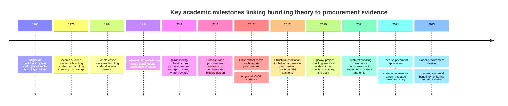
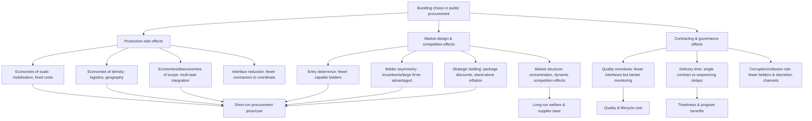

# Bundling in Public Procurement: Empirical IO Evidence, Methods, and Policy Implications

## Executive summary

Bundling in public procurement—combining multiple items, projects, or phases into a single contract (or allowing bids over bundles)—creates a fundamental tradeoff between **production efficiencies** (economies of scale/scope, reduced transaction and mobilization costs, fewer interfaces) and **market-competition effects** (reduced bidder entry, greater incumbent advantage, potential concentration and weaker discipline). This tradeoff is explicit in infrastructure procurement where physical proximity, capacity constraints, and contract complexity sharply shape who can bid and how aggressively. citeturn10view0turn16view0turn20view0turn45view0

Across the most policy-relevant empirical work in the last ~10–15 years, four patterns recur:

First, **bundling can reduce unit costs when it primarily aggregates “similar and proximate” work**, consistent with sizable but diminishing economies of scale. In Swedish highway pavement replacement, contract scale has strong cost effects, but costs rise with bundling-related complexity (more distinct objects, longer transport distances, more distinct tasks). The net effect hinges on whether added objects increase heterogeneity and logistics costs. citeturn16view0turn17view2

Second, **bundling can weaken competition through entry deterrence and bidder asymmetry**, especially when bundles require capabilities that only few firms possess. In water and sanitation projects, bundling treatment plant construction and network installation is associated with reduced entry and no evidence of positive scope economies in bidders’ cost structure, implying that “turnkey” bundling can raise procurement costs mainly through reduced participation rather than technical efficiencies. citeturn10view0turn12view1turn12view3

Third, in **package-bidding (combinatorial) settings**, allowing bidders to submit bids for bundles can unlock genuine synergies but also enables *strategic* package discounts and other behaviors that can distort allocation. Structural and reduced-form evidence from Chile’s large-scale school-meals procurement finds economically significant synergies and high allocative efficiency under the combinatorial auction design, but also documents strategic discounting not driven by cost synergies—creating a case for restricting certain combinations and using share constraints or sequencing to preserve competition over time. citeturn40view0turn42view0

Fourth, evidence is strongest when studies obtain quasi-experimental or experimental variation. A leading recent example uses quasi-random donor allocation plus randomized audits in Kenya’s electrification procurement: stricter “unbundled + stronger inspections” procedures delayed completion substantially but improved measured quality meaningfully; randomized audits raise outcomes where monitoring is weaker, suggesting **monitoring and unbundling can substitute** in some environments. citeturn9view0turn6view1

Methodologically, the empirical literature is dominated by bid- and entry-based observational designs, but the frontier is moving toward **(i) designs that plausibly exogenize bundling choices** (policy rules, donor assignment, thresholds) and **(ii) structural models that jointly handle entry, asymmetry, and bundle cost synergies**. citeturn12view3turn45view0turn42view0

## Scope and definitions

In the procurement context, “bundling” is used in at least three distinct (often conflated) ways:

Contract aggregation and lot design (“pure bundling” in some auction theory usage): the procurer defines a single tender that covers multiple objects (projects/sites) or multiple responsibilities. Many highway “project bundling” policies and some donor-funded “turnkey” contracts fit this definition. citeturn19view0turn45view0turn6view1

Task bundling across phases (“design-build”, “turnkey”, PPP-type integration): the contract combines sequential tasks where coordination externalities or incentive problems matter (e.g., design + build; build + operate). Empirical evidence in this category often focuses on quality/monitoring and interface failures rather than only bid levels. citeturn5view0turn9view0turn6view1

Package bidding / combinatorial procurement auctions: bidders can submit bids for bundles (and often stand-alone bids as well); the allocation is determined by solving a winner-determination problem. This differs from buyer-defined contract aggregation because bidders’ menu of bids endogenizes the “bundles” the buyer can purchase. citeturn37view0turn42view0turn40view0

The empirical outcome variables studied cluster into: (i) **prices/costs** (often winning bids), (ii) **bidder entry/participation**, (iii) **allocation and market concentration** (who wins and how much), and (iv) **quality and timeliness** (far less commonly measured, but central in a small number of newer studies). citeturn16view0turn12view1turn9view0

## Theoretical foundations and mapping to procurement

Classical bundling theory in IO developed around a multiproduct seller using bundling and mixed bundling to change surplus extraction, especially when valuations are imperfectly correlated (early statements appear in the block-booking/tying literature and subsequent formal IO models). citeturn52search0turn52search1turn52search2turn52search3

A key bridge to procurement is that bundling changes dispersion and correlation in what competitors “compete on”:

In monopoly sales, the classic “dispersion reduction” logic is that bundle valuations can be less dispersed than single-item valuations, which can make bundling profitable and shift welfare. citeturn52search1turn52search2

In procurement (a monopsonist buyer soliciting offers from suppliers), bundling can analogously reduce dispersion in suppliers’ effective costs for the bundle—potentially intensifying price competition—yet it can also reduce the set of firms that can participate. A procurement-side theoretical analysis emphasizes that the procurement environment can reverse some classic results; for example, mixed bundling may be dominated under procurement even though it is often weakly optimal under monopoly sales. citeturn5view1

Multi-object auction theory adds the procurement-design lens: whether to bundle objects vs sell/procure separately depends on bidder numbers, entry costs, and the structure of complementarities; procurement applications frequently confront endogenous entry rather than a fixed number of bidders. citeturn10view0turn12view1turn12view3

Combinatorial procurement auctions formalize the “synergy vs strategy” tension: allowing package bids addresses exposure risk and can realize cost synergies, but can also induce strategic bundling that worsens efficiency or increases payments absent true synergies; modern structural work explicitly separates synergies (cost primitives) from markups (strategic behavior). citeturn42view0turn41view0turn40view0

## Recent empirical IO evidence and what it shows

Empirical work over the last decade-plus is concentrated in a few procurement domains where microdata are available: infrastructure (roads, water/sanitation, electricity) and large service procurement delivered via combinatorial auctions. citeturn12view1turn16view0turn45view0turn42view0

Infrastructure lot design and contract aggregation

In developing-country water and sewage procurement, lot design is analyzed through the lens of endogenous entry and scope economies. The core finding is *negative*: bundling treatment plant development and distribution network works reduces predicted bidder participation and there is no evidence of positive scope economies in cost; unbundling is therefore predicted to reduce procurement costs in this setting. The design uses a two-stage approach with entry modeled via a truncated count process and instrumented relationships to address participation endogeneity. citeturn10view0turn12view1turn12view3

In road procurement, multiple studies estimate how bundling influences both bid levels and competition, typically finding sizable economies of scale but also evidence that bundling can reduce entry (and that effects vary by project type). For Indiana highway contracts, one study uses project and bid-tabulation databases to estimate cost models and bidder-competition models; it then uses Monte Carlo simulation to infer bundle-size thresholds beyond which costs rise as competition falls. citeturn19view0turn20view0

A complementary study models the effect of bundling on bidding competition using random-effects mixed ordinal logistic methods, concluding that bundling is generally associated with lower competition for most work categories but can increase competition in some categories (notably traffic projects), underscoring heterogeneity in mechanism responses. citeturn19view1

Swedish pavement replacement procurement provides a particularly detailed decomposition of bundling mechanics: the analysis regresses winning bids on contract scale and multiple bundling attributes (number of distinct objects, spatial spread, transportation distance, and number of distinct tasks) and separately estimates bidding participation for potential bidders using a probit model. The paper explicitly recognizes a common data limitation—winning bids rather than final payments—and frames bundling as efficient when it expands scale without proportionally expanding logistics and scope complexity. citeturn16view0turn17view2

Bundling in electricity procurement and bidder asymmetry

A structurally estimated model of Tokyo-area electricity procurement auctions studies “pure bundling” (auctioneer-defined bundles) in an environment with incumbents and new entrants and endogenous participation. The findings emphasize market-structure effects: bundling raises firm costs and increases incumbent–entrant asymmetry, helping exclude entrants; larger bundle scale mitigates the cost increase somewhat but does not meaningfully offset participation loss. Interestingly, auctioneer payment may fall in large bundled auctions while winners’ profits fall, consistent with intensified competition when cost dispersion compresses. citeturn45view0

Combinatorial procurement auctions and package design

Swedish road resurfacing procurement offers quasi-experimental variation in auction design: otherwise similar contracts and bidders are observed in regions with and without combinatorial bidding, as well as regimes where packages are bidder-chosen versus pre-specified by the buyer. Package bids are distributed lower than standalone bids in the non-combinatorial format, suggesting cost reductions from allowing package bidding in settings with synergies; however, pre-determined packages chosen by the purchaser are associated with higher costs than bidder-defined packages, indicating that procurement-side constraints can reduce synergy realization. citeturn37view0

The most intensively studied large-scale procurement combinatorial auction is Chile’s school-meals procurement. Empirical work based on bidding data finds that allowing package bids helps firms express cost synergies from scale and density (e.g., logistics and operational assets), but also identifies strategic discounting that is not driven by cost synergies—potentially creating inefficient allocations—supporting targeted restrictions on admissible combinations. It also argues that market-share restrictions and sequential auctions can promote longer-run competition without sharply raising short-run costs from unrealized synergies. citeturn40view0

A structural estimation approach applied to the same Chilean setting develops a tractable way to separate bids into cost primitives (including synergies) and strategic markups in first-price sealed-bid combinatorial auctions with thousands of package bids. The estimates imply economically meaningful synergies and report high allocative efficiency and “reasonable” procurement cost under the observed mechanism; counterfactuals compare the observed first-price combinatorial auction to alternatives such as VCG, finding VCG payments close to observed payments in this application. citeturn42view0

Bundling, monitoring, quality, and dynamic considerations

A leading recent contribution studies procurement design in Kenya’s large-scale electrification program and directly connects bundling to *quality and delay*. Using quasi-random allocation of donor funding sources across nearby villages plus randomized audits, the analysis finds a sharp tradeoff: stricter procedures with unbundling and strengthened inspections increase completion time substantially but improve measured construction quality by a large fraction of a standard deviation; randomized audits improve outcomes in lower-monitoring regimes, implying that monitoring can substitute for some benefits of unbundling in this context. citeturn9view0turn6view1

## Comparative table of empirical studies

The table prioritizes empirical work (roughly 2011–2026) that directly studies bundling/lot aggregation or package bidding in public procurement, with emphasis on identification and data.

| Citation | Year | Country/market | Data source | Empirical design | Main outcome(s) | Main findings | Key limitations |
|---|---:|---|---|---|---|---|---|
| Estache & Iimi, “(Un)bundling infrastructure procurement: Evidence from water supply and sewage projects” (Utilities Policy) citeturn10view0 | 2011 | Multiple developing countries; water/sanitation works | Official development assistance (ODA) procurement auctions; entry and bid data collected for water/sewage projects citeturn11view0 | Two-stage bid + entry modeling; IV to address endogenous participation; truncated count model for bidders citeturn10view0turn12view1turn12view3 | Bid levels; bidder entry; inferred scope economies | No evidence of positive scope economies between treatment plant and network installation; bundling reduces participation; unbundling predicted to reduce procurement costs citeturn10view0turn12view1 | Observational; bundling decisions may still correlate with unobserved project difficulty; data coverage limited (sample described as tens of auctions/countries in WP) citeturn11view0 |
| Lunander & Lundberg, “Different design – different cost: An empirical analysis of combinatorial public procurement bidding of road maintenance” (J. of Public Procurement) citeturn37view0 | 2012 | Sweden; road resurfacing (asphalt) | Public procurement bid data for homogeneous resurfacing contracts across regions and years 2009–2011 citeturn37view0 | Cross-region/time comparisons with three regimes: no package bidding vs free package bidding vs pre-defined packages; distributional comparisons citeturn37view0 | Offered price per ton; distribution of package vs standalone bids | Package bids are significantly lower than standalone bids in non-combinatorial format; buyer-imposed pre-defined packages weaken savings relative to bidder-defined packages citeturn37view0 | Limited welfare accounting; not a clean random assignment of mechanism; focuses on bids rather than lifecycle performance |
| Olivares–Weintraub–Epstein–Yung, “Combinatorial Auctions for Procurement: An Empirical Study of the Chilean School Meals Auction” (Management Science) citeturn40view0 | 2012 | Chile; school-meals service procurement | Bidding data from a large-scale combinatorial auction used annually for school meals citeturn40view0 | Empirical analysis of bid data to infer cost synergies and strategic behavior; design discussion of package restrictions and shares citeturn40view0 | Allocative efficiency and payments (conceptually); strategic bundling indicators; supplier diversification | Package bidding reveals synergies (scale/density), but also strategic discounting not driven by synergies; market-share restrictions and sequential auctions can support long-run competition without large short-run cost increases citeturn40view0 | Limited causal leverage; full mechanism counterfactuals require structural assumptions (addressed by follow-on structural work) |
| Kim–Olivares–Weintraub, “Measuring the Performance of Large-Scale Combinatorial Auctions: A Structural Estimation Approach” (working paper version used here) citeturn42view0 | 2012/2014 | Chile; school meals | Full bid histories; thousands of package bids in first-price sealed-bid CA citeturn42view0 | Structural estimation separating costs and markups using reduced-dimension markup model; counterfactuals (including VCG) citeturn42view0 | Allocative efficiency; implied costs and synergies; payments under actual vs counterfactual mechanisms | Synergies economically significant; observed CA achieves high allocative efficiency and “reasonable” cost; side constraints generate small efficiency losses; VCG payments close to observed payments in this application citeturn42view0 | Model-dependent; generalizability depends on similarity of bid environments and bidder behavior assumptions |
| Qiao–Fricker–Labi, “Effects of bundling policy on project cost under market uncertainty…” (Transportation Research Part A) citeturn19view0turn20view0 | 2019 | United States (Indiana highway procurement) | Indiana DOT bid tabulation database + scheduling/project management system; 2,528 contracts, 4,605 projects across work categories citeturn20view0 | Reduced-form regressions for award cost and bidder competition; Monte Carlo simulation to map uncertainty and bundle-size thresholds citeturn19view0 | Award costs; number of bidders; inferred bundle-size thresholds | Bundling impacts costs and bidder competition, with effects varying by project type; identifies “threshold” bundle sizes beyond which reduced competition can raise costs citeturn19view0turn20view0 | Endogenous bundling choice; results hinge on modeling assumptions in simulation; focuses on cost/entry rather than realized quality |
| Qiao–Labi–Fricker, “Does highway project bundling policy affect bidding competition? …” (Transportation Research Part A) citeturn19view1 | 2021 | United States; highway contracts by work category | Publisher-hosted article (data described as highway bundling/standalone with year heterogeneity) citeturn19view1 | Random-effects mixed ordinal logistic modeling of bidder competition; accounts for year heterogeneity citeturn19view1 | Bidding competition intensity (number of bidders categories) | Bundling generally reduces competition for many categories but may increase it in traffic projects; proximity increases competition citeturn19view1 | Paywalled details limit replication here; causal identification remains challenging without exogenous bundling variation |
| Ridderstedt & Nilsson, “Economies of scale versus the costs of bundling…” (Transportation Research Part A) citeturn16view0turn17view2 | 2023 | Sweden; national highway pavement replacement | Swedish infrastructure manager contracts 2012–2015; 540 contracts listed; analysis sample ~290 unit-price contracts plus bidder/plant geodata citeturn17view2 | OLS estimates of translog-style cost function on winning bids; scenario predictions; probit entry model for potential bidders citeturn16view0turn17view2 | Winning bid levels; entry/participation | Strong but diminishing scale economies; net bundling gains depend on proximity/similarity; bundling-related transport distance and task heterogeneity can dominate savings; bundling affects participation citeturn16view0turn17view2 | Uses winning bids due to missing final-payment data; bundling policy likely endogenous to unobserved complexity citeturn17view0 |
| Suzuki, “Investigating Pure Bundling in Japan’s Electricity Procurement Auctions” (Mathematics) citeturn45view0 | 2021 | Japan (Tokyo-area public electricity procurement) | Identified auctions (2004–2007) and bidder structure with incumbent + entrants citeturn45view0 | Structural auction estimation with asymmetric bidders and endogenous participation citeturn45view0 | Firm costs; entry; auction payments; winner profits | Bundling raises costs and asymmetry; excludes entrants; larger bundles mitigate cost increases but not participation losses; payments may fall in large bundles; winner profits fall under bundling citeturn45view0 | Data period earlier than publication; conclusions depend on structural assumptions; limited direct quality measures |
| Wolfram–Miguel–Hsu–Berkouwer, “Donor Contracting Conditions and Public Procurement…” (NBER WP 30948; latest version) citeturn9view0turn6view1 | 2023–2026 | Kenya; electrification infrastructure contracting | Administrative contracts + engineering quality assessments + power quality data + surveys; donor-driven procedural variation + randomized audits citeturn9view0turn6view1 | Quasi-random donor assignment across nearby villages; RCT audits to separate bundling vs monitoring citeturn9view0turn6view1 | Completion delay; quality; connectivity and network outcomes | Unbundling + strengthened inspections delays completion (~16 months) but improves quality (~0.6 SD); audits improve outcomes in lower-monitoring settings; monitoring and unbundling act as substitutes in this context citeturn9view0turn6view1 | External validity depends on donor/government context; welfare depends on discounting assumptions and long-run maintenance effects citeturn6view1 |

## Methodological appendix: identification and robustness

The central empirical problem is that bundling is rarely randomly assigned. Procurers choose bundling based on factors that also affect bids, entry, and performance (project complexity, urgency, internal capacity, political constraints). Without credible exogenous variation, estimates risk conflating “bundling effects” with “selection into bundling.” citeturn17view0turn12view1turn19view0

Common identification challenges

Endogenous bidder participation. Entry decisions respond to expected profits, entry costs, and bundle design; treating the number of bidders as exogenous typically biases estimates of competition effects. Studies addressing this either model participation explicitly (count models, probit entry) or embed entry into structural estimation. citeturn12view3turn17view2turn45view0

Separating true synergies from strategic bidding. In combinatorial auctions, observed package discounts can reflect genuine cost complementarities (scale/density) or strategic discounting that changes allocation and payments. Structural methods aim to recover costs separately from markups; reduced-form comparisons often examine bid distributions across auction formats or package constraints. citeturn42view0turn37view0turn40view0

Contract heterogeneity and multidimensional performance. Many datasets measure bids but not final expenditure, change orders, or operational performance. Where final payments are missing, bid-based inference may misstate fiscal impacts if renegotiation/adjustments correlate with bundling. citeturn17view0turn20view0

Measuring quality and lifecycle value. The frontier moves beyond price to direct measurement of construction quality and downstream service outcomes; this is essential to welfare, especially when bundling changes monitoring and incentives. citeturn9view0turn6view1

Dynamic market-structure effects. Bundling can exclude entrants today, reducing competition tomorrow; conversely, diversification constraints can preserve a supplier base. Empirical work rarely has sufficiently long panels matched to firm capabilities and entry histories to quantify these dynamics, though the Chile school-meals work explicitly motivates such concerns. citeturn40view0turn45view0

Robustness checks and practices observed in the literature

Explicit entry modeling and/or instruments for participation are used to reduce bias from endogenous bidder counts (e.g., constructing instruments from exogenous workload proxies in aid-financed infrastructure auctions). citeturn12view3turn12view1

Rich controls for geography and logistics are essential when bundling is spatial (distance between objects, plant locations), and designs that decompose bundling into interpretable components improve policy transferability (e.g., “scale” vs “spread” vs “number of tasks”). citeturn16view0turn17view2

Counterfactual simulations are used to translate reduced-form estimates into policy choices (bundle-size thresholds; alternative package constraints); however, these outputs are sensitive to modeling assumptions. citeturn19view0turn42view0

The highest-credibility evidence leverages quasi-random assignment (donor rules, administrative discontinuities) and randomized interventions (audits), enabling clearer separation of bundling from monitoring and other co-moving reforms. citeturn9view0turn6view1

## Policy implications for procurement agencies

The empirical record supports a “targeted bundling” doctrine: bundle when synergies are high and predictable, but explicitly manage entry and quality risks.

Use ex ante bundle evaluation tools. Before tendering, simulate candidate bundle configurations using historical bid/entry models: forecast (i) expected number of bidders and (ii) expected winning bid under alternative bundle sizes and proximity rules. Studies in road procurement demonstrate that cost-minimizing bundle size can be category-specific and non-monotone. citeturn19view0turn20view0turn16view0

Bundle “like with like” and “near with near.” Evidence from Swedish pavement replacement emphasizes that proximity and task similarity are central: bundle expansion that increases task variety or transport distance can eliminate scale benefits. citeturn16view0turn17view2

Avoid bundling across weakly related scopes unless scope economies are documented. In water/sanitation procurement, bundling treatment plant and network installation shows no scope economies and risks entry loss; this supports default unbundling across technologically distinct components absent project-specific evidence. citeturn10view0turn12view1

Treat entry and bidder asymmetry as first-order design variables, not byproducts. Structural evidence in electricity procurement indicates bundling can increase incumbent advantage and reduce entrant participation; when supplier-base development matters, agencies should use lotting or package constraints to keep participation feasible. citeturn45view0

If using combinatorial auctions, avoid over-restricting packages, but constrain strategically. Swedish evidence suggests bidder-defined packages yield lower costs than purchaser-defined packages, but procurement agencies may still need constraints to control predatory or exclusionary strategies. citeturn37view0

Combine bundling policy with monitoring policy. The Kenya electrification evidence implies that stronger monitoring can substitute for some benefits of unbundling, and that “bundled + weak monitoring” may underperform “bundled + audits” or “unbundled + inspections” depending on the buyer’s time horizon and quality sensitivity. citeturn9view0turn6view1

Measure what matters: quality and lifecycle cost. Where possible, link procurement choices to engineering quality, maintenance, and service outcomes; otherwise, cost-only optimization can be misleading, especially in infrastructure. citeturn9view0turn6view1turn17view0

## Open research questions and recommended empirical strategies

What remains under-identified

Causal effects of bundling on long-run market structure. The literature frequently measures immediate entry and bid effects but rarely observes whether bundling accelerates consolidation, reduces participation in future tenders, or changes investment in capacity. This gap is emphasized indirectly by evidence on asymmetry and entry exclusion. citeturn45view0turn12view1

Bundling and corruption/strategic misprocurement channels. Many papers motivate competition as a safeguard against collusion and corrupt practices, but bundling-specific causal evidence is scarce in the empirical IO canon relative to price and entry estimates. citeturn10view0turn11view0

Price vs quality tradeoffs in bundling regimes. High-quality causal evidence exists in only a small number of settings where quality is directly measured; most work equates “value for money” with bids. citeturn9view0turn6view1turn17view0

Cross-market spillovers from large bundles. Large contracts can absorb capacity and affect bidding in other tenders; the aid-financed infrastructure literature uses aggregate workload proxies as entry instruments, hinting at this channel but not mapping it fully. citeturn12view3turn12view1

Recommended empirical strategies and data to close gaps

Exploit administrative discontinuities and rules that shift lotting/bundling. Many procurement systems have thresholds (contract value, urgency, framework eligibility) that plausibly shift bundling intensity; regression discontinuity or close-call designs could improve causal attribution where policy is sharp.

Use “design-based” variation layered on policy variation. The Kenya study’s combination of quasi-random donor procedures with randomized audits is a template: layering randomized monitoring, information disclosure, or verification intensity on naturally varying bundling creates interpretable causal decompositions. citeturn9view0turn6view1

Build integrated datasets that join bids to ex post payments and performance. The Swedish road work highlights the common inability to observe final payments; future studies should prioritize linking award data to change orders, realized quantities, and maintenance outcomes to avoid price-only conclusions. citeturn17view0turn16view0

Model bundling as a multi-dimensional treatment, not a binary indicator. Papers that separately measure scale, spatial spread, number of objects, and task heterogeneity produce policy-relevant levers (what to bundle and how), and can be generalized across agencies. citeturn16view0turn17view2

Combine structural auction models with reduced-form validation. Structural approaches can compute welfare and counterfactuals in package-bidding environments, but should be paired with reduced-form checks (e.g., distributional comparisons across package constraints) and sensitivity analysis around markup specifications. citeturn42view0turn37view0

Connect procurement bundling to classical bundling theory explicitly in welfare terms. A promising agenda is to empirically measure when procurement bundling acts like “dispersion reduction” in seller cost distributions (potentially intensifying price competition) versus when it functions like foreclosure/entry restriction; theory suggests both are possible, and newer structural work in electricity procurement and large-scale combinatorial auctions provides empirical building blocks. citeturn5view1turn45view0turn42view0turn52search0turn52search1